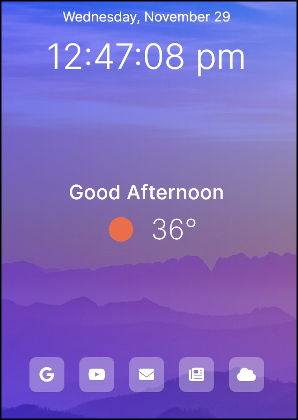

# personalized-homepage

## Description:

- Develop a simple, dynamic, responsive and aesthetically appealing homepage for my personal computing endeavors.

- The web application provides the user the current date and time in their city/region. The current temperature and corresponding weather icon dynamically adjusts during the day along with pleasant greeting. At the bottom, there are is simple navigation shortcut list for the user to operate instead of a toolbar or other technological tool.

- Technologies used for this project: HTML, CSS, Javascript, JQuery, Netlify, OpenWeather API, Bootstrap, and Font Awesome.

## User Story:

- AS AN full-stack developer studying and working mostly remote,
- I WANT to create an appealing and practical Home-Page,
- SO THAT I can view the current date, time, weather, and provide easy access to my favorite navigation shortcuts I use on a regular basis.

## Final Product

  

## Future Adjustments and Opportunities:

- Security: best business and security practices, hide the public WeatherApp API using Netlify Serverless Functions, dotenv, etc.

- Automatic and dynamic IPA fetching: fetching and using the User's current IP address to pull the physical location, then taking that location and pulling the current weather report using OpenWeather API. Best business practice for the average User who isn't accustomed to manually updating this code on their end.

## Developer's Submitted Work:

- URL of the <u>deployed application</u>: <a href="https://my-hompage2.netlify.app/" target="_blank" rel="noopener noreferrer">My Homepage</a>
- URL of the application's <u>GitHub Repository</u>: [CLocky60](#)

## License

- This project is licensed under the terms of the MIT license.

- This project is for developer use only.

---
